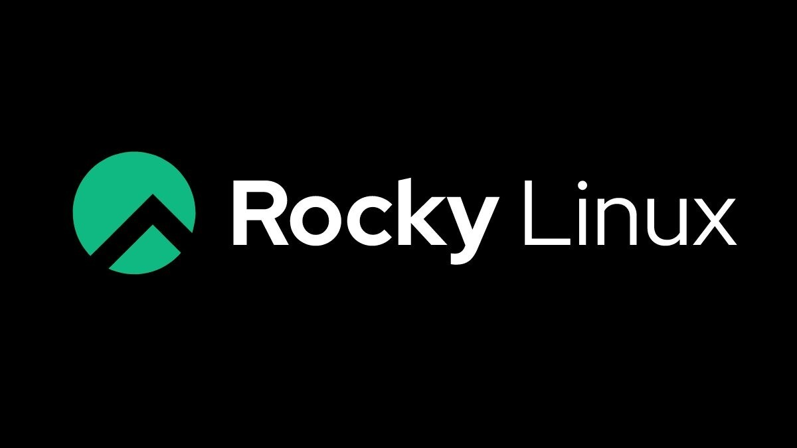

# 0.- Introducción
- ¿Qué es Rocky Linux?

Rocky Linux es una distribución de Linux, desarrollada por Rocky Enterprise Software Foundation. Está destinada para ser una distribución "downstream",
lanzada completamente para ser compatible con código binario usando el código de fuente del sistema operativo de Red Hat Enterprise Linux.

Rocky Linux es una distribución basada en RHEL y que se lanzó como un sustituto a CentOS.

- ¿En que versión se encuentra ahora mismo?

La versión actual de la distribución es Rocky Linux 8 (EOL: 31 de mayo de 2029). En noviembre de 2021 se publicó la versión 8.5 y la última versión publicada, 
a fecha de mayo de 2022, es Rocky Linux 8.6

