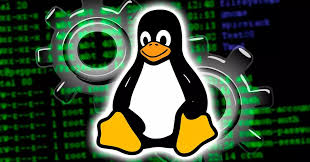

# 1.- Paquetes RPMç

- ¿Qué son los paquetes rpm?

RPM Package Manager es una herramienta de administración de paquetes pensada para GNU/Linux. Es capaz de instalar, actualizar, 
desinstalar, verificar y solicitar programas.

