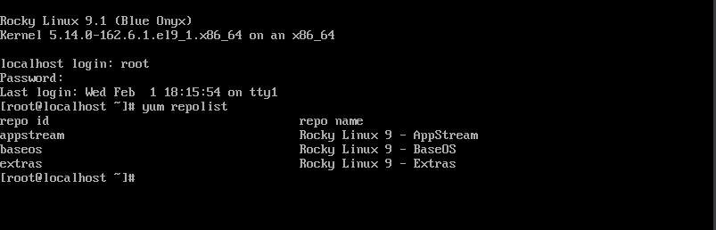
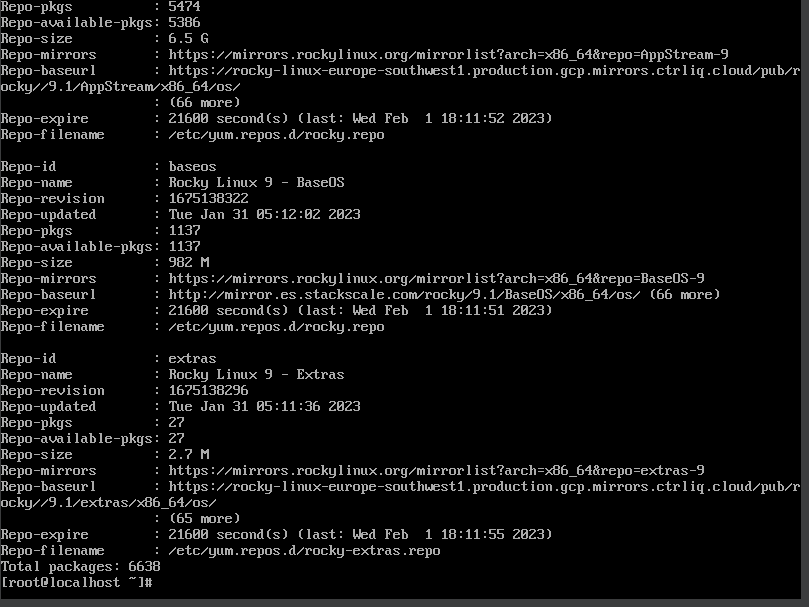
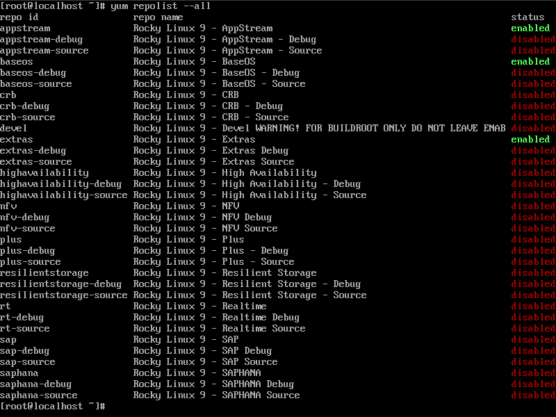
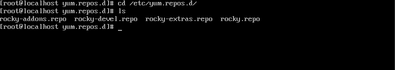

# 2.-Repositorios Rocky Linux

- ¿Dónde se encuentra los repositorios?
Los repositorios se enciuentran en "/etc/yum.repos.d/". Aquí podremos accedere mediante el comando "cd /etc/yum.repos.d/" y podemos
ver su contenido con el comando "ls". 
Algunos comandos nos dan "pistas" de donde se encuentran los repositorios, por ejemplo, "yum repoinfo" nos dará toda la información sobre 
los repositorios instalados y en el apartado de "Repo-filename" podemos ver la ruta en la cual se guarda estos repositorios.

A continuación voy a dejar todos los comandos utilizados para poder llevar a cabo esta busqueda.

- "yum repolist"

Hara una lista de todos los repositorios habilitados en su sistema

- "yum repoinfo"

Generar información adicional sobre los repositorios

- "yum repolist --all"

Muestra los repositorios habilitados y deshabilitados

- "ls /etc/yum.repos.d/"

Te muestra la carpeta donde se guardan los repositorios 

